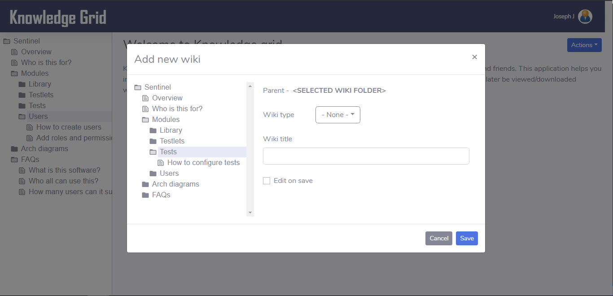
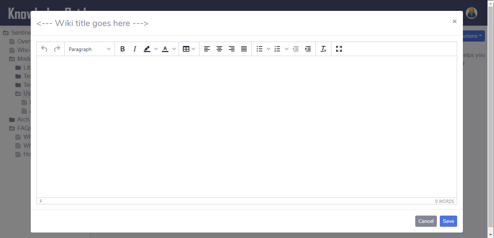

# The Knowledge Grid

Knowledge grid is an browser based wiki, which is built using **MERN** stack. User interface is built using **reactjs** and **redux** as state management system. Back-end API's are done in **nodejs** and **mongodb** as database.

Knowledge grid lets you record and share your knowledge with your colleagues and friends. This application lets you record your knowledge in text, image and video formats. It also supports uploading documents which can later be viewed/downloaded whenever needed.

### Technology stack

### How to use

Application uses different npm packages on both client and server. To run this application, packages need to be installed by navigating to **client**, **server** and **app** folders using the command

- cd <-folder-name->
- npm install

*Note - To run this command local machine should have **nodejs** installed.*

Each folder **client**, **server** and **app** has its own packages.json file, which has command to run application. We can run the application by navigating to corresponding folder and run command

- npm start

To run both client and server from same command prompt, we can run **npm start** from app folder. We used a package called concurrently for achieving this.

### Screen mockups

